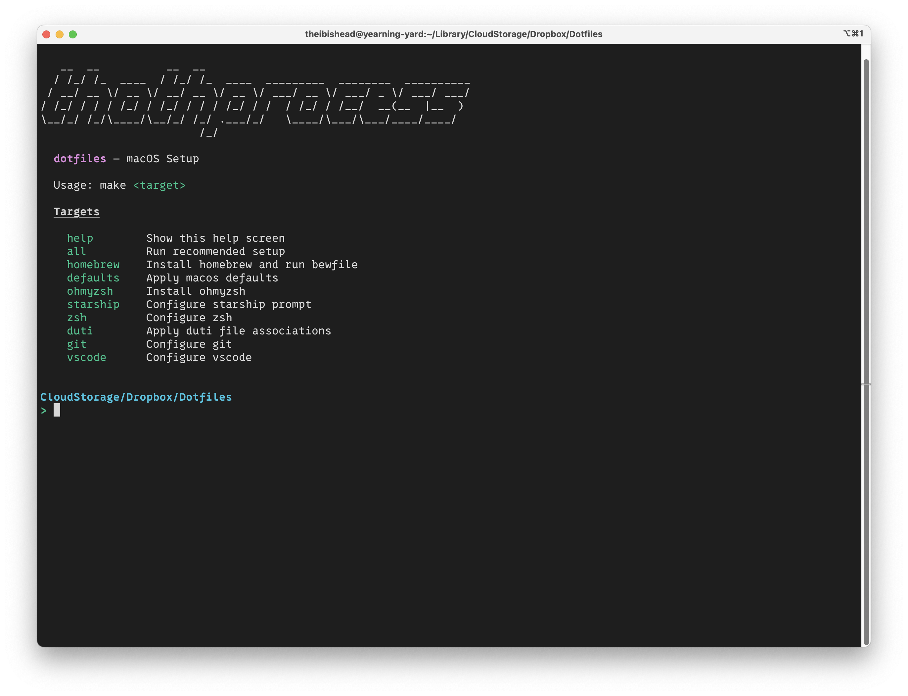

# dotfiles

My personal macOS configuration and setup scripts.

<p align="center">
  <br>
  <em>Help screen</em>
</p>

## Contents

- **`homebrew/`** — Homebrew configuration
- **`macos/`** — Macos configuration
- **`zsh/`** — Zsh configuration
- **`duti/`** — Duti configuration
- **`git/`** — Git configuration
- **`vscode/`** — Vscode configuration
- **`Makefile`** — Automation targets

## Usage

Clone the repository and run the relevant scripts to apply settings:

```sh
git clone https://github.com/the-ibis-head/dotfiles.git
cd dotfiles
```

---

*Generated by [tp](https://github.com/the-ibis-head/tp)*
